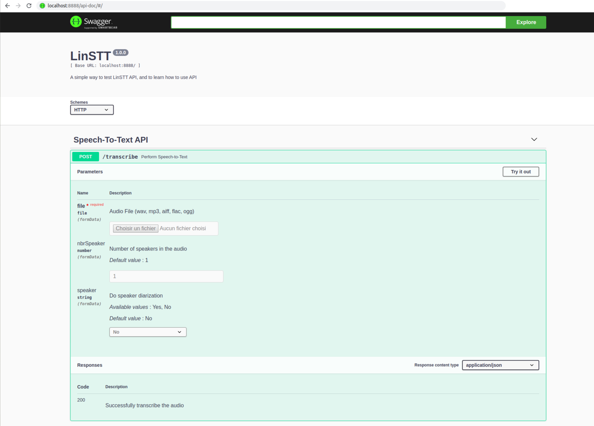

# Automatic Speech Recognition - LinSTT: Get Started 

## Installation

### Packaged in Docker
To start the LinSTT service on your local machine or your cloud, you need first to download the [source code](https://github.com/linto-ai/linto-platform-stt-standalone-worker) and set the environment file, as follows:

```bash
git clone https://github.com/linto-ai/linto-platform-stt-standalone-worker
cd linto-platform-stt-standalone-worker
mv .envdefault .env
```

Then, to build the docker image, execute:

```bash
docker build -t lintoai/linto-platform-stt-standalone-worker .
```

Or by docker-compose, by using:
```bash
docker-compose build
```


Or, download the pre-built image from docker-hub:

```bash
docker pull lintoai/linto-platform-stt-standalone-worker:latest
```

NOTE: You must install docker on your machine. See installation instruction in [Infrastructure](infra?id=prerequistes)

## Configuration
The LinSTT service that will be set-up here require KALDI models, the acoustic model and the decoding graph. Indeed, these models are not included in the repository; you must download them in order to run LinSTT. You can use our pre-trained models from here: [linstt download](services/linstt_download).

### Outside LinTO-Platform-STT-Service-Manager

If you want to use our service alone without LinTO-Platform-STT-Service-Manager, you must `unzip` the files and put the extracted ones in the [shared storage](infra?id=shared-storage). For example,

1- Download the French acoustic model and the small decoding graph

```bash
wget https://dl.linto.ai/downloads/model-distribution/acoustic-models/fr-FR/linSTT_AM_fr-FR_v1.0.0.zip
wget https://dl.linto.ai/downloads/model-distribution/decoding-graphs/LVCSR/fr-FR/decoding_graph_fr-FR_Small_v1.0.0.zip
```

2- Uncompress both files

```bash
unzip linSTT_AM_fr-FR_v1.0.0.zip -d AM_fr-FR
unzip decoding_graph_fr-FR_Small_v1.0.0.zip -d DG_fr-FR_Small
```

3- Move the uncompressed files into the shared storage directory

```bash
mv AM_fr-FR ~/linto_shared/data
mv DG_fr-FR_Small ~/linto_shared/data
```

4- Rename the default environment file `.envdefault` included in the repository `linto-platform-stt-standalone-worker` and configure it by providing the full path of the following parameters:

    AM_PATH=/full/path/to/linto_shared/data/AM_fr-FR
    LM_PATH=/full/path/to/linto_shared/data/DG_fr-FR_Small

5- If you want to use Swagger interface, you need to set the corresponding environment parameter:
    SWAGGER_PATH=/full/path/to/swagger/file

NOTE: if you want to use the user interface of the service, you need also to configure the swagger file `document/swagger.yml` included in the repository `linto-platform-stt-standalone-worker`. Specifically, in the section `host`, specify the address of the machine in which the service is deployed.

### Using LinTO-Platform-STT-Service-Manager
In case you want to use `LinTO-Platform-STT-Service-Manager`, you need to:

1- Create an acoustic model and upload the approriate file

2- Create a language model and upload the corresponding decoding graph

3- Configure the environment file of this service.

For more details, see configuration instruction in [LinTO - STT-Manager](services/stt_manager?id=configuration)

## Execute
In order to run the service alone, you have only to execute:

```bash
cd linto-platform-stt-standalone-worker
docker-compose up
```
Then you can acces it on [localhost:8888](localhost:8888)

To run and manager LinSTT under `LinTO-Platform-STT-Service-Manager` service, you need to create a service first and then to start it. See [LinTO - STT-Manager](services/stt_manager?id=execute)

Our service requires an audio file in `Waveform format`. It should has the following parameters:

    - sample rate: 16000 Hz
    - number of bits per sample: 16 bits
    - number of channels: 1 channel
    - microphone: any type
    - duration: <30 minutes

Other formats are also supported: mp3, aiff, flac, and ogg.

### Run Example Applications
To run an automated test go to the test folder

```bash
cd linto-platform-stt-standalone-worker/test
```

And run the test script:

```bash
./test_deployment.sh
```

Or use swagger interface to perform your personal test: localhost:8888/api-doc/




<!-- tabs:start -->

#### ** /transcribe **

Convert a speech to text

### Functionality
>  `post`  <br>
> Make a POST request
>>  <b  style="color:green;">Arguments</b> :
>>  -  **{File} file** : Audio file (file format: wav, mp3, aiff, flac, ogg)
>>  -  **{Integer} nbrSpeaker (optional)**: Number of speakers engaged in dialog
>>  -  **{String} speaker (optional)**: Do speaker diarization (yes|no)
>
>>  <b  style="color:green;">Header</b> :
>>  -  **{String} Accept**: response content type (text/plain|application/json)
>
>  **{text|Json}** : Return the full transcription or a json object with metadata

<!-- tabs:end -->
